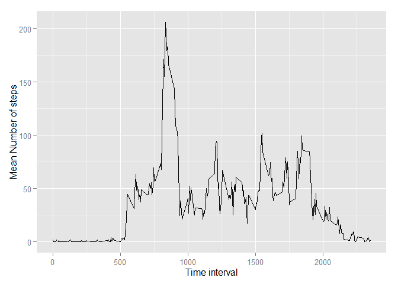
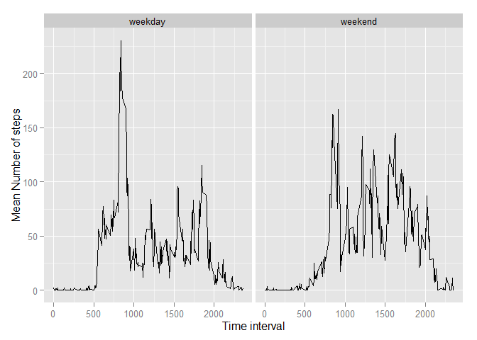

# Reproducible Research: Peer Assessment 1

## Loading and preprocessing the data


```r
require(ggplot2)
```

```
## Loading required package: ggplot2
```

```
## Warning: package 'ggplot2' was built under R version 3.1.2
```

```r
strPath <- "E:\\Marek\\Studia\\Coursera\\Reproducible Research\\PA_1\\"
Imp.Activity <- read.csv(paste(strPath,"activity.csv", sep=""))
```

## What is mean total number of steps taken per day?
1. Calculate the total number of steps taken per day
2. Make a histogram
3. Calculate and report the mean and median of the total number of steps taken per day

```r
Proc.Activity <- aggregate(steps ~ date, Imp.Activity, sum, na.rm=TRUE)
g <- ggplot(Proc.Activity, aes(x=steps)) + geom_histogram(binwidth=500)
print(g)
```

 

```r
# Mean
mean(Proc.Activity$steps)
```

```
## [1] 10766.19
```

```r
# Median
median(Proc.Activity$steps)
```

```
## [1] 10765
```

## What is the average daily activity pattern?
1. Make a time series plot of the 5-minute interval (x-axis) and the average number of steps taken, averaged across all days (y-axis)
2. Which 5-minute interval, on average across all the days in the dataset, contains the maximum number of steps?

```r
Proc.Activity <- aggregate(steps ~ interval, Imp.Activity, mean, na.rm=TRUE)
g <- ggplot(Proc.Activity, aes(x=interval, y=steps)) + geom_line() + xlab("Time interval") + ylab("Mean Number of steps")
print(g)
```

 

## Imputing missing values
1. Calculate and report the total number of missing values in the dataset.
2. Devise a strategy for filling in all of the missing values in the dataset.
3. Create a new dataset that is equal to the original dataset but with the missing data filled in.
4. Make a histogram of the total number of steps taken each day and Calculate and report the mean and median total number of steps taken per day. Comment on results.

```r
# There are 2304 missing values for 'steps'
summary(Imp.Activity)
```

```
##      steps                date          interval     
##  Min.   :  0.00   2012-10-01:  288   Min.   :   0.0  
##  1st Qu.:  0.00   2012-10-02:  288   1st Qu.: 588.8  
##  Median :  0.00   2012-10-03:  288   Median :1177.5  
##  Mean   : 37.38   2012-10-04:  288   Mean   :1177.5  
##  3rd Qu.: 12.00   2012-10-05:  288   3rd Qu.:1766.2  
##  Max.   :806.00   2012-10-06:  288   Max.   :2355.0  
##  NA's   :2304     (Other)   :15840
```

```r
# Fill NAs with mean values for each interval calculated above
names(Proc.Activity)[2] <- "mean_steps"
Proc.NA_fill <- merge(Imp.Activity, Proc.Activity, by=c("interval"), all.x=TRUE)
Proc.NA_fill$steps <- ifelse(is.na(Proc.NA_fill$steps), Proc.NA_fill$mean_steps, Proc.NA_fill$steps)

# New dataset equal to the 
Imp.Activity.New <- Proc.NA_fill[,c("steps","date","interval")]
summary(Imp.Activity.New)
```

```
##      steps                date          interval     
##  Min.   :  0.00   2012-10-01:  288   Min.   :   0.0  
##  1st Qu.:  0.00   2012-10-02:  288   1st Qu.: 588.8  
##  Median :  0.00   2012-10-03:  288   Median :1177.5  
##  Mean   : 37.38   2012-10-04:  288   Mean   :1177.5  
##  3rd Qu.: 27.00   2012-10-05:  288   3rd Qu.:1766.2  
##  Max.   :806.00   2012-10-06:  288   Max.   :2355.0  
##                   (Other)   :15840
```

```r
Proc.Activity.New <- aggregate(steps ~ date, Imp.Activity.New, sum, na.rm=TRUE)
g <- ggplot(Proc.Activity.New, aes(x=steps)) + geom_histogram(binwidth=500)
print(g)
```

 

```r
# Mean
mean(Proc.Activity.New$steps, na.rm=TRUE)
```

```
## [1] 10766.19
```

```r
# Median
median(Proc.Activity.New$steps, na.rm=TRUE)
```

```
## [1] 10766.19
```

```r
# Conclusion: Daily mean remained almost unchanged, median is currently equal to mean.
```

## Are there differences in activity patterns between weekdays and weekends?
1. Create a new factor variable in the dataset with two levels – “weekday” and “weekend”
2. Make a panel plot containing a time series plot of the 5-minute interval (x-axis) and the average number of steps taken, averaged across all weekday days or weekend days (y-axis).

```r
require(plyr)
```

```
## Loading required package: plyr
```

```
## Warning: package 'plyr' was built under R version 3.1.2
```

```r
Imp.Activity.New$date <- as.Date(Imp.Activity.New$date)
Imp.Activity.New$DayType <- as.factor(ifelse(weekdays(Imp.Activity.New$date) %in% c("sobota","niedziela"),"weekend", "weekday"))
Proc.Activity.New <- ddply(Imp.Activity.New, .(interval,DayType),summarize, steps = mean(steps))
g <- ggplot(Proc.Activity.New, aes(x=interval, y=steps)) + geom_line() + xlab("Time interval") + 
    ylab("Mean Number of steps") + facet_grid(. ~ DayType)
print(g)
```

 

